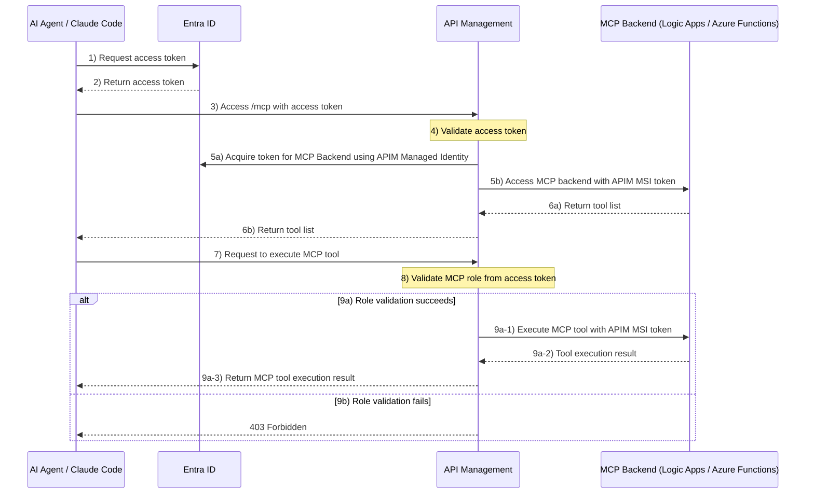
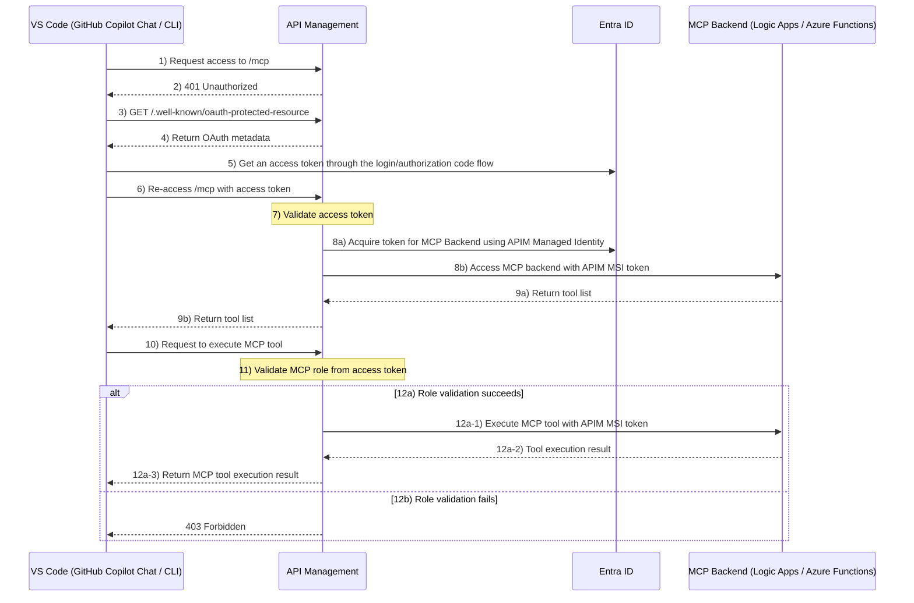

# End-to-End MCP Protection with API Management × MCP × OAuth

This repository provides a hands-on learning experience for implementing end-to-end protection using API Management × MCP × OAuth.

## Hands-On Overview

This hands-on lab demonstrates the end-to-end flow for securely executing MCP in two patterns:

- **AI Agent / Claude Code → APIM → MCP**
- **VS Code (GitHub Copilot Chat / CLI) → APIM → MCP**

### AI Agent / Claude Code → APIM → MCP

The overall flow when executing MCP from an AI Agent (e.g., MS Foundry Agent) or Claude Code.  
Both clients acquire an access token in advance (via managed identity, service principal or `az login`) and attach it to requests — the APIM flow is identical.



### VS Code (GitHub Copilot Chat / CLI) → APIM → MCP

The overall flow when executing MCP from VS Code (GitHub Copilot Chat or CLI).  
Both Chat and CLI in VS Code share the same OAuth authorization flow — they discover the OAuth endpoint from APIM and authenticate interactively.



## Architecture Features

This hands-on lab implements robust end-to-end security through the following five elements:

### 1. OAuth2 Authorization

User authentication and access token issuance via Entra ID.

### 2. Token Validation

APIM validates OAuth access tokens (issuer / audience / signature / expiration) and blocks unauthorized requests.

### 3. Role-Based Authorization

Evaluates MCP roles (claims) within the access token for fine-grained tool execution control.

### 4. Secretless Connection

APIM's Managed Identity (MSI) enables secure access to MCP Backend, eliminating credential leakage risks.

### 5. Backend Protection

MCP Backend uses Easy Auth to allow only APIM's MSI, preventing direct external access.

## Deploy Hands-On Environment

Deploy the environment using Azure Developer CLI (azd) with the following steps.


### Prerequisites

Ensure the following are installed locally:

- Terraform (recommended: v1.5 or later)
- Azure Developer CLI (`azd`, recommended: v1.9 or later)

### Deployment Steps

```bash
azd up
```

### Delete Resources

```bash
azd down
```

## Hands-On

### AI Agent / Claude Code → APIM → MCP

Reproduce the sequence of operations where an AI Agent (e.g., MS Foundry Agent) or Claude Code invokes MCP.  
Both clients authenticate by acquiring an Azure access token upfront — AI Agent uses Python scripts, Claude Code uses `.mcp.json` with `headersHelper`.


#### Steps

**1. Set Up Python Environment**

Navigate to the `samplecodes/` directory, create and activate a Python virtual environment, and install the required Python packages.

```bash
cd samplecodes
python -m venv oauthmcp
source oauthmcp/bin/activate
pip install azure.identity
```

**2. Configure Environment Variables**

Set the required values dynamically from the azd environment.

```bash
export OAUTH_APP_ID="$(azd env get-value OAUTH_APP_ID)"
export MCP_URL="$(azd env get-value LOGICAPP_MCP_ENDPOINTS)"
```

**3. Verify Access Token**

Run `check.entraid_token.py` and verify that `hello_project1` is included in the `roles` claim.

```bash
python check.entraid_token.py | grep -v '^===' \
  | jq 'if .roles then (if (.roles | any(. == "hello_project1")) then "✅ OK: hello_project1 is included in roles" else "❌ NG: hello_project1 not found in roles — run az logout && az login" end) else "⚠️ roles claim is missing — run az logout && az login" end'
```

**4. Retrieve MCP Tool List**

Run `mcp_tool_list.py` to verify that the tool list can be retrieved.

```bash
python mcp_tool_list.py
```

**5. Execute MCP Tool (Success Case)**

Execute the `hello_project1` tool and confirm it succeeds.

```bash
export MCP_TOOL_NAME="hello_project1"
python mcp_tool_call.py
```

**6. Execute MCP Tool (Rejection Case)**

Execute the `hello_project2` tool and confirm it is rejected due to lack of permissions.

```bash
export MCP_TOOL_NAME="hello_project2"
python mcp_tool_call.py
```

#### Claude Code

Claude Code connects to APIM-protected MCP servers using the same token-based flow.  
The `headersHelper` field in `.mcp.json` calls `az account get-access-token` at startup, so no interactive browser login is required.

> **Tips**
>
> **Why Azure CLI token instead of OAuth client credentials?**  
> Claude Code natively supports OAuth authorization via Dynamic Client Registration (DCR). However, Entra ID does not support DCR. Static client registration is an alternative, but it requires distributing a client secret to each user, which poses a security risk. As a practical workaround, Claude Code can be configured to acquire a token via the Azure CLI (`az login`) using `headersHelper` instead.
>
> **Access token expiry and reconnection**  
> Azure AD access tokens are valid for 1 hour. `headersHelper` runs only when Claude Code starts or when the MCP connection is re-established — it does not refresh tokens automatically mid-session. If the token expires during a session, restart Claude Code or reconnect the MCP server to obtain a fresh token.
>
> **Why pre-authorizing Azure CLI is safe**  
> The `headersHelper` command acquires a token scoped to this hands-on's Entra ID app (`api://<OAUTH_APP_ID>`) using the Azure CLI client ID (`04b07795-8ddb-461a-bbee-02f9e1bf7b46`). This is the same pattern Microsoft uses for its own first-party services (e.g., `https://ai.azure.com`) — they are pre-authorized against Entra ID and obtain tokens via Azure CLI in the same way. Additionally, the OAuth app registered here is single-tenant, so only users who can sign in to this specific tenant can obtain a token. The Terraform resource that enables this is:
>
> ```hcl
> resource "azuread_application_pre_authorized" "oauth_app" {
>   application_id       = azuread_application.oauth_app.id
>   authorized_client_id = "04b07795-8ddb-461a-bbee-02f9e1bf7b46" # Azure CLI
>
>   permission_ids = [
>     azuread_application_permission_scope.user_impersonation.scope_id,
>   ]
> }
> ```

**1. Configure `.mcp.json`**

Generate `.mcp.json` dynamically using `azd env get-value`.

```bash
cd $(git rev-parse --show-toplevel)
FUNC_URL="$(azd env get-value FUNC_MCP_ENDPOINTS)"
LA_URL="$(azd env get-value LOGICAPP_MCP_ENDPOINTS)"
OAUTH_APP_ID="$(azd env get-value OAUTH_APP_ID)"
HELPER="TOKEN=\$(az account get-access-token --scope 'api://${OAUTH_APP_ID}/.default' --query accessToken -o tsv) && echo \"{\\\"Authorization\\\": \\\"Bearer \$TOKEN\\\"}\""
jq -n --arg func_url "$FUNC_URL" --arg la_url "$LA_URL" --arg helper "$HELPER" \
  '{mcpServers: {
    "func-hello-mcp":  {type: "http", url: $func_url, headersHelper: $helper},
    "logic-hello-mcp": {type: "http", url: $la_url,   headersHelper: $helper}
  }}' \
  > .mcp.json
```

**3. Execute MCP Tool (Success Case)**

Prompt the following in Claude Code and confirm that the MCP tool executes successfully.

```
Use func-hello-mcp to say hello to project1
```

**4. Execute MCP Tool (Rejection Case)**

Prompt the following and confirm that execution is rejected due to lack of permissions.

```
Use func-hello-mcp to say hello to project2
```

### VS Code (GitHub Copilot Chat / CLI) → APIM → MCP

Verify the sequence of operations where VS Code (GitHub Copilot Chat or CLI) invokes MCP.


#### Steps

**1. Edit MCP Configuration File**

Update `.vscode/mcp.json` with the URL from the azd environment.

```bash
cd $(git rev-parse --show-toplevel)
FUNC_URL="$(azd env get-value FUNC_MCP_ENDPOINTS)"
LA_URL="$(azd env get-value LOGICAPP_MCP_ENDPOINTS)"
jq -n --arg func_url "$FUNC_URL" --arg la_url "$LA_URL" \
  '{servers: {
    "func-hello-mcp":  {type: "http", url: $func_url},
    "logic-hello-mcp": {type: "http", url: $la_url}
  }}' \
  > .vscode/mcp.json
```

**2. Verify MCP Tool List Retrieval**

After saving the configuration file, start MCP. When prompted for Entra ID authentication, authenticate and verify that the tool list is correctly retrieved.

**3. Execute MCP Tool (Success Case)**

**GitHub Copilot Chat (agent mode):** Prompt the following and confirm that the MCP tool executes successfully.

```
Use func-hello-mcp to say hello to project1
```

**GitHub Copilot CLI:** Run the following in the terminal and confirm the tool executes successfully.

```bash
copilot -p "Use func-hello-mcp to say hello to project1" --allow-all-tools
```

**4. Execute MCP Tool (Rejection Case)**

**GitHub Copilot Chat (agent mode):** Prompt the following and confirm that execution is rejected due to lack of permissions.

```
Use func-hello-mcp to say hello to project2
```

**GitHub Copilot CLI:** Run the following and confirm the tool is rejected due to lack of permissions.

```bash
copilot -p "Use func-hello-mcp to say hello to project2" --allow-all-tools
```

## Technical Details and Use Cases

[Technical Details and Use Cases](./tech_usecase.md)

## Conclusion

This repository provides a hands-on experience with end-to-end security implementation combining API Management × MCP × OAuth.

### Approach to AI Security

In AI security, I believe that "strict authentication and authorization at the entry point based on zero-trust principles" is the most critical factor in preventing risks proactively.

However, security and convenience are always in a trade-off relationship. While this world is often discussed in binary terms, achieving the right balance is essential in practical operations.


In this hands-on lab, we incorporated the following design considerations to balance convenience and security:

- **Scope of Authorization**: Rather than blocking everything, we focused role-based authorization specifically on MCP tool invocations
- **Integrated Authentication Flow**: Designed to leverage Microsoft account tokens from VS Code directly for MCP authorization without compromising developer experience

"Where to defend at the entry point, and where to allow for user experience" — this decision is the core of practical security design.

To make such design decisions, it's essential to not only acquire external knowledge (extroversion) from official documentation and other sources, but also engage deeply with yourself (introversion) to explore your own solutions. Simply seeking answers externally won't lead to optimal architecture.


### Final Thoughts

Security should be **"a safety mechanism to prevent misuse," not "a restriction on users and developers."** The security features implemented in this hands-on lab are intended to function as such positive safety mechanisms.

I hope this repository serves as a helpful resource for your security design in systems utilizing AI agents and MCP.

## References

- [Fine-Grained Role Control for MCP Tools with APIM](https://dev.to/imdj/fine-grained-role-control-for-mcp-tools-with-apim-2pn7)
- [ID-JUG (Identity Assertion Authorization Grant)](https://github.com/oauth-wg/oauth-identity-assertion-authz-grant/blob/main/draft-ietf-oauth-identity-assertion-authz-grant.md)
