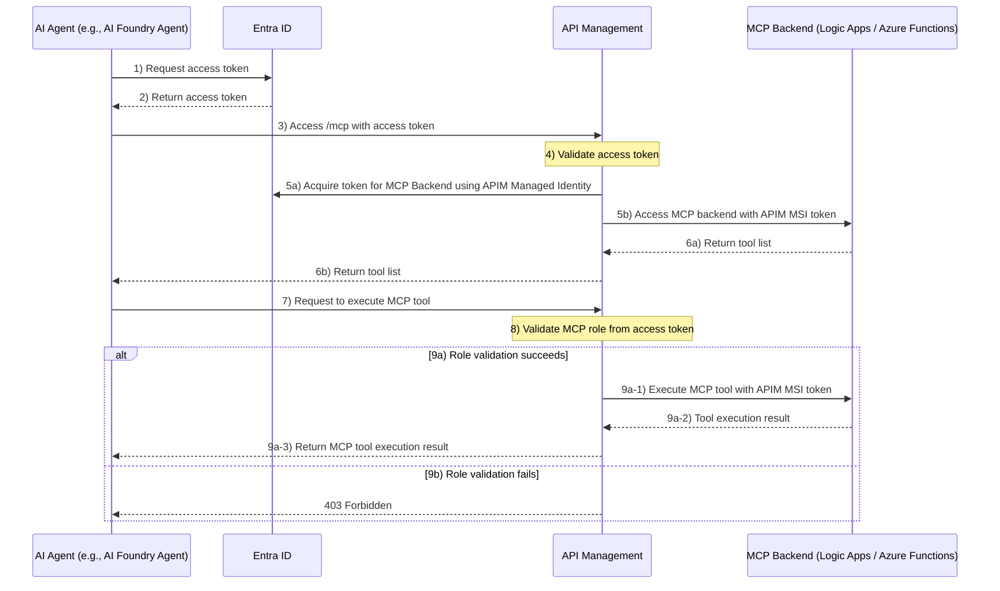
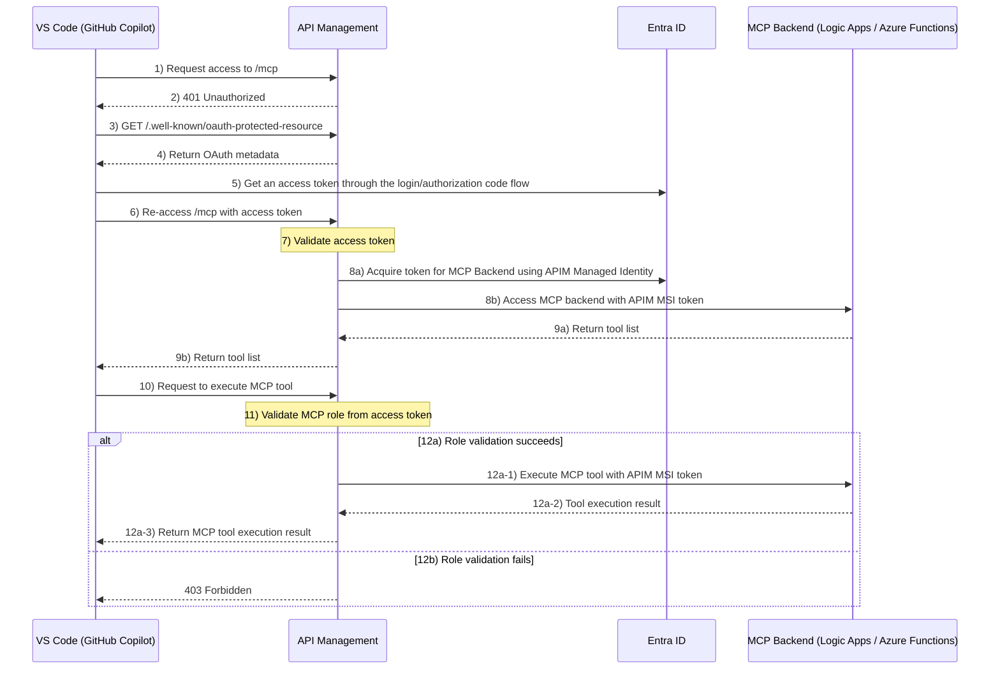
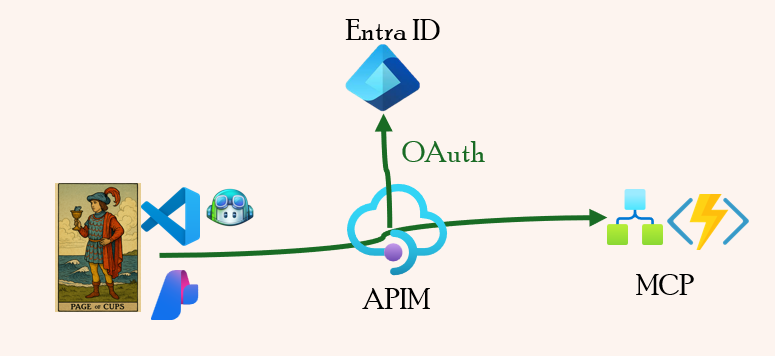
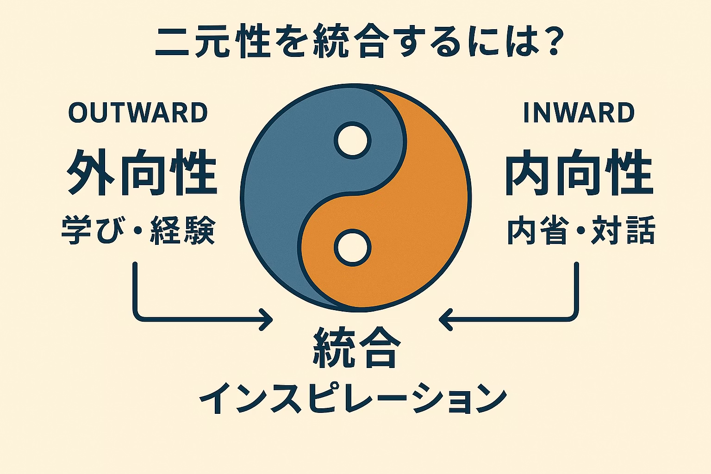

# End-to-End MCP Protection with API Management × MCP × OAuth

This repository provides a hands-on learning experience for implementing end-to-end protection using API Management × MCP × OAuth.

## Hands-On Overview

This hands-on lab demonstrates the end-to-end flow for securely executing MCP in two patterns:

- **AI Agent → APIM → MCP**
- **VS Code (GitHub Copilot) → APIM → MCP**

### AI Agent → APIM → MCP

The overall flow when executing MCP from an AI Agent.



### VS Code (GitHub Copilot) → APIM → MCP

The overall flow when executing MCP from VS Code (GitHub Copilot).



## Architecture Features

This hands-on lab implements robust end-to-end security through the following five elements:

### 1. OAuth2 Authorization

User authentication and access token issuance via Entra ID.

### 2. Token Validation

APIM validates OAuth access tokens (issuer / audience / signature / expiration) and blocks unauthorized requests.

### 3. Role-Based Authorization

Evaluates MCP roles (claims) within the access token for fine-grained tool execution control.

### 4. Secretless Connection

APIM's Managed Identity (MSI) enables secure access to MCP Backend, eliminating credential leakage risks.

### 5. Backend Protection

MCP Backend uses Easy Auth to allow only APIM's MSI, preventing direct external access.

## Deploy Hands-On Environment

Deploy the environment using Azure Developer CLI (azd) with the following steps.



### Prerequisites

Ensure the following are installed locally:

- Terraform (recommended: v1.5 or later)
- Azure Developer CLI (`azd`, recommended: v1.9 or later)

### Deployment Steps

```bash
azd up
```

### Delete Resources

```bash
azd down
```

## Hands-On

### AI Agent → APIM → MCP

Reproduce the sequence of operations where an AI Agent (e.g., Azure AI Foundry Agent) invokes MCP using Python scripts.


#### Steps

**1. Set Up Python Environment**

Navigate to the `samplecodes/` directory, create and activate a Python virtual environment, and install the required Python packages.

```bash
cd samplecodes
python -m venv oauthmcp
source oauthmcp/bin/activate
pip install azure.identity
```

**2. Configure Environment Variables**

Set the required values from the `azd up` output.

```bash
export OAUTH_APP_ID="<OAUTH-APP-ID from azd up output>"
export MCP_URL="<LOGICAPP_MCP_ENDPOINTS from azd up output>"
```

**3. Verify Access Token**

Run `check.entraid_token.py` to verify the access token claims.

```bash
python check.entraid_token.py
```

Confirm that `roles` are included as shown below (if roles are missing, run `az logout` and `az login` again).

```json
"roles": [
    "hello_project1"
]
```

**4. Retrieve MCP Tool List**

Run `mcp_tool_list.py` to verify that the tool list can be retrieved.

```bash
python mcp_tool_list.py
```

**5. Execute MCP Tool (Success Case)**

Execute the `hello_project1` tool and confirm it succeeds.

```bash
export MCP_TOOL_NAME="hello_project1"
python mcp_tool_call.py
```

**6. Execute MCP Tool (Rejection Case)**

Execute the `hello_project2` tool and confirm it is rejected due to lack of permissions.

```bash
export MCP_TOOL_NAME="hello_project2"
python mcp_tool_call.py
```

### VS Code (GitHub Copilot) → APIM → MCP

Verify the sequence of operations where VS Code (GitHub Copilot) invokes MCP.


#### Steps

**1. Edit MCP Configuration File**

Edit VS Code's `mcp.json` to configure the MCP server. Set the URL obtained from the `azd up` output.

```json
{
  "servers": {
    "func-hello-mcp": {
      "url": "<FUNC_MCP_ENDPOINTS from azd up output>",
      "type": "http"
    }
  },
  "inputs": []
}
```

**2. Verify MCP Tool List Retrieval**

After saving the configuration file, start MCP. When prompted for Entra ID authentication, authenticate and verify that the tool list is correctly retrieved.

**3. Execute MCP Tool (Success Case)**

Prompt the following in GitHub Copilot Chat (agent mode) and confirm that the MCP tool executes successfully.

```
Use func-hello-mcp to say hello to project1
```

**4. Execute MCP Tool (Rejection Case)**

Prompt the following in GitHub Copilot Chat (agent mode) and confirm that execution is rejected due to lack of permissions.

```
Use func-hello-mcp to say hello to project2
```

## Technical Details and Use Cases

[Technical Details and Use Cases](./tech_usecase.md)

## Conclusion

This repository provides a hands-on experience with end-to-end security implementation combining API Management × MCP × OAuth.

### Approach to AI Security

In AI security, I believe that "strict authentication and authorization at the entry point based on zero-trust principles" is the most critical factor in preventing risks proactively.

However, security and convenience are always in a trade-off relationship. While this world is often discussed in binary terms, achieving the right balance is essential in practical operations.


In this hands-on lab, we incorporated the following design considerations to balance convenience and security:

- **Scope of Authorization**: Rather than blocking everything, we focused role-based authorization specifically on MCP tool invocations
- **Integrated Authentication Flow**: Designed to leverage Microsoft account tokens from VS Code directly for MCP authorization without compromising developer experience

"Where to defend at the entry point, and where to allow for user experience" — this decision is the core of practical security design.

To make such design decisions, it's essential to not only acquire external knowledge (extroversion) from official documentation and other sources, but also engage deeply with yourself (introversion) to explore your own solutions. Simply seeking answers externally won't lead to optimal architecture.



### Final Thoughts

Security should be **"a safety mechanism to prevent misuse," not "a restriction on users and developers."** The security features implemented in this hands-on lab are intended to function as such positive safety mechanisms.

I hope this repository serves as a helpful resource for your security design in systems utilizing AI agents and MCP.

## References

- [Fine-Grained Role Control for MCP Tools with APIM](https://dev.to/imdj/fine-grained-role-control-for-mcp-tools-with-apim-2pn7)
- [ID-JUG (Identity Assertion Authorization Grant)](https://github.com/oauth-wg/oauth-identity-assertion-authz-grant/blob/main/draft-ietf-oauth-identity-assertion-authz-grant.md)
