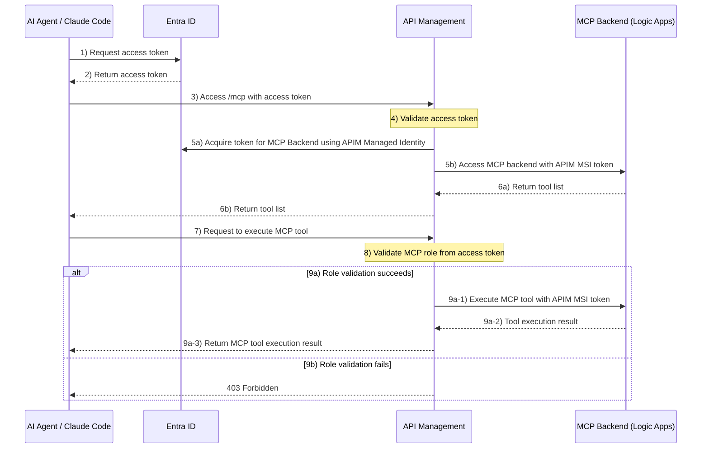
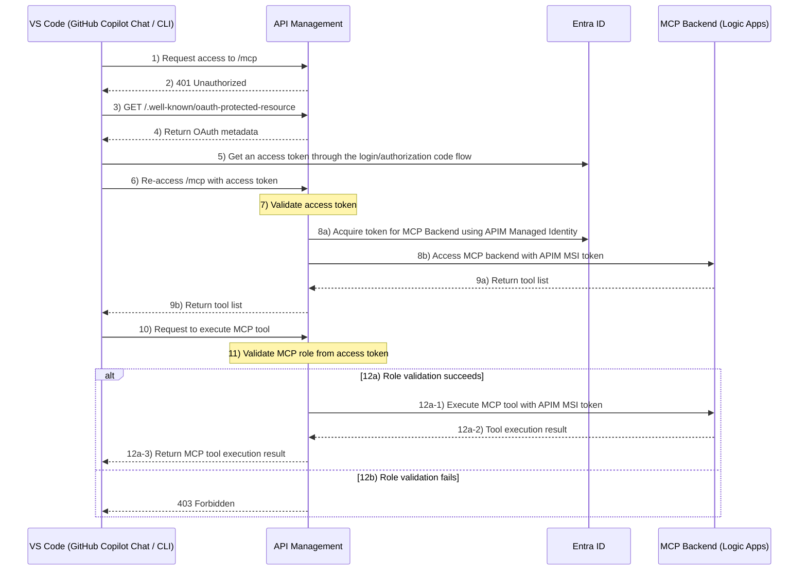
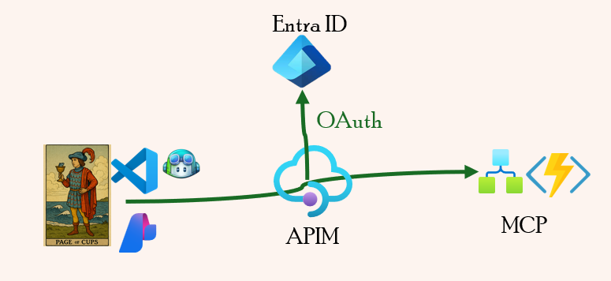

# End-to-End MCP Protection with API Management × MCP × OAuth

This repository provides a hands-on learning experience for implementing end-to-end protection using API Management × MCP × OAuth.

## Hands-On Overview

This hands-on lab demonstrates the end-to-end flow for securely executing MCP in two patterns:

- **AI Agent / Claude Code → APIM → MCP**
- **VS Code (GitHub Copilot Chat / CLI) → APIM → MCP**

### AI Agent / Claude Code → APIM → MCP

The overall flow when executing MCP from an AI Agent (e.g., MS Foundry Agent) or Claude Code.  
Both clients acquire an access token in advance (via managed identity, service principal or `az login`) and attach it to requests — the APIM flow is identical.


```mermaid
sequenceDiagram
    participant Agent as AI Agent / Claude Code
    participant Entra as Entra ID
    participant APIM as API Management
    participant MCP as MCP Backend (Logic Apps)

    Agent->>Entra: 1) Request access token
    Entra-->>Agent: 2) Return access token

    Agent->>APIM: 3) Access /mcp with access token
    Note over APIM: 4) Validate access token
    APIM->>Entra: 5a) Acquire token for MCP Backend using APIM Managed Identity
    APIM->>MCP: 5b) Access MCP backend with APIM MSI token
    MCP-->>APIM: 6a) Return tool list
    APIM-->>Agent: 6b) Return tool list

    Agent->>APIM: 7) Request to execute MCP tool
    Note over APIM: 8) Validate MCP role from access token

    alt 9a) Role validation succeeds
        APIM->>MCP: 9a-1) Execute MCP tool with APIM MSI token
        MCP-->>APIM: 9a-2) Tool execution result
        APIM-->>Agent: 9a-3) Return MCP tool execution result
    else 9b) Role validation fails
        APIM-->>Agent: 403 Forbidden
    end
```

### VS Code (GitHub Copilot Chat / CLI) → APIM → MCP

The overall flow when executing MCP from VS Code (GitHub Copilot Chat or CLI).  
Both Chat and CLI in VS Code share the same OAuth authorization flow — they discover the OAuth endpoint from APIM and authenticate interactively.


```mermaid
sequenceDiagram
    participant VS as VS Code (GitHub Copilot Chat / CLI)
    participant APIM as API Management
    participant ID as Entra ID
    participant MCP as MCP Backend (Logic Apps)

    VS->>APIM: 1) Request access to /mcp
    APIM-->>VS: 2) 401 Unauthorized

    VS->>APIM: 3) GET /.well-known/oauth-protected-resource
    APIM-->>VS: 4) Return OAuth metadata

    VS->>ID: 5) Get an access token through the login/authorization code flow

    VS->>APIM: 6) Re-access /mcp with access token
    Note over APIM: 7) Validate access token
    APIM->>ID: 8a) Acquire token for MCP Backend using APIM Managed Identity
    APIM->>MCP: 8b) Access MCP backend with APIM MSI token
    MCP-->>APIM: 9a) Return tool list
    APIM-->>VS: 9b) Return tool list

    VS->>APIM: 10) Request to execute MCP tool
    Note over APIM: 11) Validate MCP role from access token

    alt 12a) Role validation succeeds
        APIM->>MCP: 12a-1) Execute MCP tool with APIM MSI token
        MCP-->>APIM: 12a-2) Tool execution result
        APIM-->>VS: 12a-3) Return MCP tool execution result
    else 12b) Role validation fails
        APIM-->>VS: 403 Forbidden
    end
```

## Architecture Features

This hands-on lab implements robust end-to-end security through the following five elements:

### 1. OAuth2 Authorization

User authentication and access token issuance via Entra ID.

### 2. Token Validation

APIM validates OAuth access tokens (issuer / audience / signature / expiration) and blocks unauthorized requests.

### 3. Role-Based Authorization

Evaluates MCP roles (claims) within the access token for fine-grained tool execution control.

### 4. Secretless Connection

APIM's Managed Identity (MSI) enables secure access to MCP Backend, eliminating credential leakage risks.

### 5. Backend Protection

MCP Backend enforces authorization at two layers:

- **Easy Auth (Entra ID)**: Platform-level token validation — rejects any request without a valid Entra ID bearer token.
- **App Role check (`Mcp.Invoke`)**: Application-level check — rejects callers whose token does not contain the `Mcp.Invoke` App Role, even if the token itself is valid.

This means only two types of callers can reach the backend directly:

1. **APIM Managed Identity** — holds a permanent `Mcp.Invoke` role assignment, used for all production traffic.
2. **Ops Entra ID group members** — assigned `Mcp.Invoke` via the ops group, for direct-access troubleshooting and testing.

## Deploy Hands-On Environment

Deploy the environment using Azure Developer CLI (azd) with the following steps.



### Prerequisites

Ensure the following are installed locally:

- Terraform (recommended: v1.5 or later)
- Azure Developer CLI (`azd`, recommended: v1.9 or later)

### Deployment Steps

**1. Deploy**

```bash
azd up
```

### Delete Resources

```bash
azd down
```

## Troubleshooting

### Application Insights Billing Feature 409 Conflict on `azd up`

**Symptoms**

Running `azd up` fails with one or both of the following errors.

**Error 1: Billing Feature update failure**

```
Error: update Billing Feature for Component ...: unexpected status 409 (409 Conflict)
  with error: PreconditionFailed (412)
  with azurerm_application_insights.ai, on main.tf line 231
```

**Error 2: Resource already exists**

```
Error: a resource with the ID ".../providers/Microsoft.Insights/components/appi-..." already exists
  with azurerm_application_insights.ai, on main.tf line 231
```

**Cause**

The AzureRM provider always calls the Billing Feature PATCH API when applying `azurerm_application_insights`. If the ETag on the Azure side has drifted from the Terraform state, the call fails with 412 PreconditionFailed — a known provider behavior.

Re-running `azd up` after Error 1 will trigger Error 2 as a follow-on failure.

**Resolution** (if you encountered Error 1, then re-ran `azd up` and hit Error 2)

1. Initialize modules and providers

```bash
terraform -chdir=infra init -upgrade
```

2. Import the existing Azure resource into Terraform state

```bash
ENV_NAME="$(azd env list --output json | jq -r '.[0].Name')"
SUBSCRIPTION_ID="$(azd env get-value AZURE_SUBSCRIPTION_ID --environment "$ENV_NAME")"
RG="$(az group list --subscription "$SUBSCRIPTION_ID" --tag "azd-env-name=${ENV_NAME}" --query '[0].name' -o tsv)"
APPINSIGHTS_ID="$(az resource list --subscription "$SUBSCRIPTION_ID" -g "$RG" --resource-type "Microsoft.Insights/components" --query '[0].id' -o tsv)"

terraform -chdir=infra import \
  -state=".azure/${ENV_NAME}/infra/terraform.tfstate" \
  -var-file=".azure/${ENV_NAME}/infra/main.tfvars.json" \
  azurerm_application_insights.ai \
  "$APPINSIGHTS_ID"
```

3. Re-run the deployment

```bash
azd up
```

## Hands-On

### AI Agent / Claude Code → APIM → MCP

Reproduce the sequence of operations where an AI Agent (e.g., MS Foundry Agent) or Claude Code invokes MCP.  
Both clients authenticate by acquiring an Azure access token upfront — AI Agent uses Python scripts, Claude Code uses `.mcp.json` with `headersHelper`.


```mermaid
sequenceDiagram
    participant Agent as AI Agent / Claude Code
    participant Entra as Entra ID
    participant APIM as API Management
    participant MCP as MCP Backend (Logic Apps)

    Agent->>Entra: 1) Request access token
    Entra-->>Agent: 2) Return access token

    Agent->>APIM: 3) Access /mcp with access token
    Note over APIM: 4) Validate access token
    APIM->>Entra: 5a) Acquire token for MCP Backend using APIM Managed Identity
    APIM->>MCP: 5b) Access MCP backend with APIM MSI token
    MCP-->>APIM: 6a) Return tool list
    APIM-->>Agent: 6b) Return tool list

    Agent->>APIM: 7) Request to execute MCP tool
    Note over APIM: 8) Validate MCP role from access token

    alt 9a) Role validation succeeds
        APIM->>MCP: 9a-1) Execute MCP tool with APIM MSI token
        MCP-->>APIM: 9a-2) Tool execution result
        APIM-->>Agent: 9a-3) Return MCP tool execution result
    else 9b) Role validation fails
        APIM-->>Agent: 403 Forbidden
    end
```

#### Steps

**1. Set Up Python Environment**

Navigate to the `samplecodes/` directory, create and activate a Python virtual environment, and install the required Python packages.

```bash
cd samplecodes
python -m venv oauthmcp
source oauthmcp/bin/activate
pip install azure.identity
```

**2. Configure Environment Variables**

Set the required values dynamically from the azd environment.

```bash
export OAUTH_APP_ID="$(azd env get-value OAUTH_APP_ID)"
export MCP_URL="$(azd env get-value LOGICAPP_MCP_ENDPOINTS)"
```

**3. Verify Access Token**

Run `check.entraid_token.py` and verify that `hello_project1` is included in the `roles` claim.

```bash
python check.entraid_token.py | grep -v '^===' \
  | jq 'if .roles then (if (.roles | any(. == "hello_project1")) then "✅ OK: hello_project1 is included in roles" else "❌ NG: hello_project1 not found in roles — run az logout && az login" end) else "⚠️ roles claim is missing — run az logout && az login" end'
```

**4. Retrieve MCP Tool List**

Run `mcp_tool_list.py` to verify that the tool list can be retrieved.

```bash
python mcp_tool_list.py
```

**5. Execute MCP Tool (Success Case)**

Execute the `hello_project1` tool and confirm it succeeds.

```bash
export MCP_TOOL_NAME="hello_project1"
python mcp_tool_call.py
```

**6. Execute MCP Tool (Rejection Case)**

Execute the `hello_project2` tool and confirm it is rejected due to lack of permissions.

```bash
export MCP_TOOL_NAME="hello_project2"
python mcp_tool_call.py
```

#### Claude Code

Claude Code connects to APIM-protected MCP servers using the same token-based flow.  
The `headersHelper` field in `.mcp.json` calls `az account get-access-token` at startup, so no interactive browser login is required.

> **Tips**
>
> **Why Azure CLI token instead of OAuth client credentials?**  
> Claude Code natively supports OAuth authorization via Dynamic Client Registration (DCR). However, Entra ID does not support DCR. Static client registration is an alternative, but it requires distributing a client secret to each user, which poses a security risk. As a practical workaround, Claude Code can be configured to acquire a token via the Azure CLI (`az login`) using `headersHelper` instead.
>
> **Access token expiry and reconnection**  
> Azure AD access tokens are valid for 1 hour. `headersHelper` runs only when Claude Code starts or when the MCP connection is re-established — it does not refresh tokens automatically mid-session. If the token expires during a session, restart Claude Code or reconnect the MCP server to obtain a fresh token.
>
> **Why pre-authorizing Azure CLI is safe**  
> The `headersHelper` command acquires a token scoped to this hands-on's Entra ID app (`api://<OAUTH_APP_ID>`) using the Azure CLI client ID (`04b07795-8ddb-461a-bbee-02f9e1bf7b46`). This is the same pattern Microsoft uses for its own first-party services (e.g., `https://ai.azure.com`) — they are pre-authorized against Entra ID and obtain tokens via Azure CLI in the same way. Additionally, the OAuth app registered here is single-tenant, so only users who can sign in to this specific tenant can obtain a token. The Terraform resource that enables this is:
>
> ```hcl
> resource "azuread_application_pre_authorized" "oauth_app" {
>   application_id       = azuread_application.oauth_app.id
>   authorized_client_id = "04b07795-8ddb-461a-bbee-02f9e1bf7b46" # Azure CLI
>
>   permission_ids = [
>     azuread_application_permission_scope.user_impersonation.scope_id,
>   ]
> }
> ```

**1. Configure `.mcp.json`**

Generate `.mcp.json` dynamically using `azd env get-value`.

```bash
cd $(git rev-parse --show-toplevel)
LA_URL="$(azd env get-value LOGICAPP_MCP_ENDPOINTS)"
OAUTH_APP_ID="$(azd env get-value OAUTH_APP_ID)"
HELPER="TOKEN=\$(az account get-access-token --scope 'api://${OAUTH_APP_ID}/.default' --query accessToken -o tsv) && echo \"{\\\"Authorization\\\": \\\"Bearer \$TOKEN\\\"}\""
jq -n --arg la_url "$LA_URL" --arg helper "$HELPER" \
  '{mcpServers: {
    "logic-hello-mcp": {type: "http", url: $la_url, headersHelper: $helper}
  }}' \
  > .mcp.json
```

**2. Execute MCP Tool (Success Case)**

Prompt the following in Claude Code and confirm that the MCP tool executes successfully.

```
Use logic-hello-mcp to say hello to project1
```

**3. Execute MCP Tool (Rejection Case)**

Prompt the following and confirm that execution is rejected due to lack of permissions.

```
Use logic-hello-mcp to say hello to project2
```

### VS Code (GitHub Copilot Chat / CLI) → APIM → MCP

Verify the sequence of operations where VS Code (GitHub Copilot Chat or CLI) invokes MCP.


```mermaid
sequenceDiagram
    participant VS as VS Code (GitHub Copilot Chat / CLI)
    participant APIM as API Management
    participant ID as Entra ID
    participant MCP as MCP Backend (Logic Apps)

    VS->>APIM: 1) Request access to /mcp
    APIM-->>VS: 2) 401 Unauthorized

    VS->>APIM: 3) GET /.well-known/oauth-protected-resource
    APIM-->>VS: 4) Return OAuth metadata

    VS->>ID: 5) Get an access token through the login/authorization code flow

    VS->>APIM: 6) Re-access /mcp with access token
    Note over APIM: 7) Validate access token
    APIM->>ID: 8a) Acquire token for MCP Backend using APIM Managed Identity
    APIM->>MCP: 8b) Access MCP backend with APIM MSI token
    MCP-->>APIM: 9a) Return tool list
    APIM-->>VS: 9b) Return tool list

    VS->>APIM: 10) Request to execute MCP tool
    Note over APIM: 11) Validate MCP role from access token

    alt 12a) Role validation succeeds
        APIM->>MCP: 12a-1) Execute MCP tool with APIM MSI token
        MCP-->>APIM: 12a-2) Tool execution result
        APIM-->>VS: 12a-3) Return MCP tool execution result
    else 12b) Role validation fails
        APIM-->>VS: 403 Forbidden
    end
```

#### Steps

**1. Start MCP**

When prompted for Entra ID authentication, authenticate through the browser and verify that the tool list is correctly retrieved.

**2. Execute MCP Tool (Success Case)**

**GitHub Copilot Chat (agent mode):** Prompt the following and confirm that the MCP tool executes successfully.

```
Use logic-hello-mcp to say hello to project1
```

**GitHub Copilot CLI:** Launch the Copilot CLI interactive session.

```bash
copilot
```

In the interactive session, send the following message and confirm that the MCP tool executes successfully.

```
Use logic-hello-mcp to say hello to project1
```

**3. Execute MCP Tool (Rejection Case)**

**GitHub Copilot Chat (agent mode):** Prompt the following and confirm that execution is rejected due to lack of permissions.

```
Use logic-hello-mcp to say hello to project2
```

**GitHub Copilot CLI:** In the interactive session, send the following message and confirm that execution is rejected due to lack of permissions.

```
Use logic-hello-mcp to say hello to project2
```

## Technical Details and Use Cases

[Technical Details and Use Cases](./tech_usecase.md)

## Conclusion

This repository provides a hands-on experience with end-to-end security implementation combining API Management × MCP × OAuth.

### A Note on Where This Sits

If you continue on to [apim-mcp-a2a-oauth](https://github.com/apc-n-orita/apim-mcp-a2a-oauth) and then [APICenter](https://github.com/apc-n-orita/APICenter), you'll be walking a three-repository arc that also traces a shape from the tarot's Major Arcana.

This repository already holds both the **Hierophant** and the **Hermit** — not one after the other, but side by side. OAuth2, token validation, and role-based authorization rest on official documentation and established patterns: that's the Hierophant, learning what's already agreed upon. But forcing every caller through APIM as a token broker — a managed-identity token swap paired with Easy Auth on the backend, so direct access is closed off — and using PIM for Groups to grant an ops team JIT access, are original combinations of existing building blocks, not copied whole from a single guide. And the finding that APIM and the backend can silently disagree on which of two duplicate JSON keys wins — a possible authorization bypass — was only found by testing the actual deployed backend, not by reading about it anywhere. That's the Hermit, already at work right here.

The next repository carries the same mixture forward, just with the balance shifted further inward. And the one after that gathers all three back together, without mixing them, into a single undivided circle — the **World**. This repository's part in that is simply to be a solid first outline, so the later stages have something to stand on.

## References

- [Fine-Grained Role Control for MCP Tools with APIM](https://dev.to/imdj/fine-grained-role-control-for-mcp-tools-with-apim-2pn7)
- [ID-JUG (Identity Assertion Authorization Grant)](https://github.com/oauth-wg/oauth-identity-assertion-authz-grant/blob/main/draft-ietf-oauth-identity-assertion-authz-grant.md)
